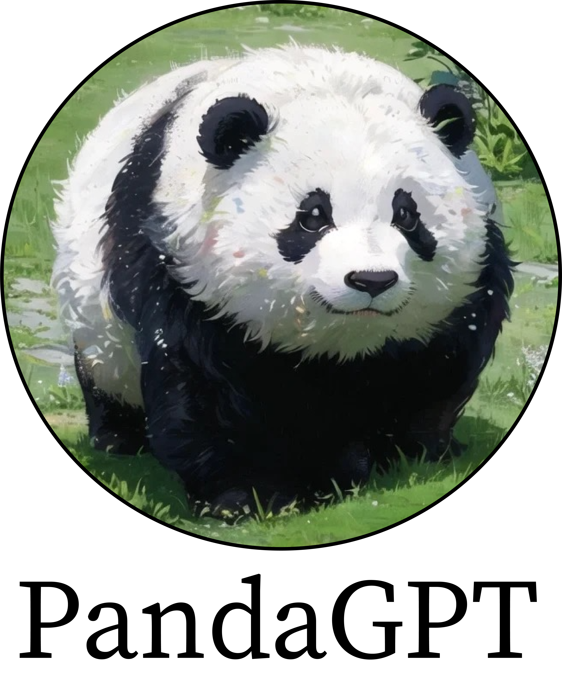
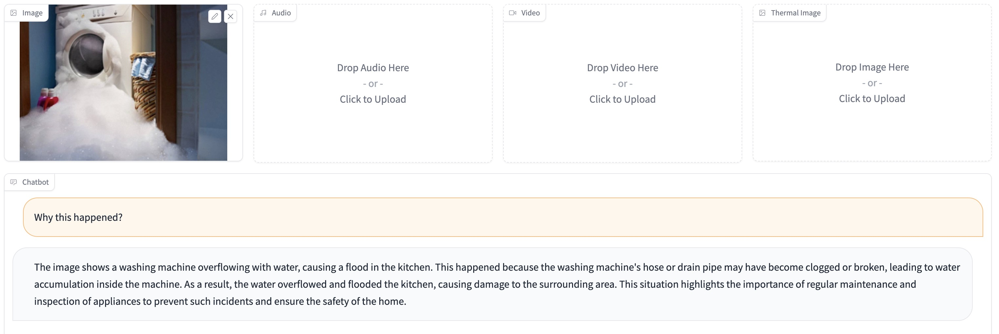
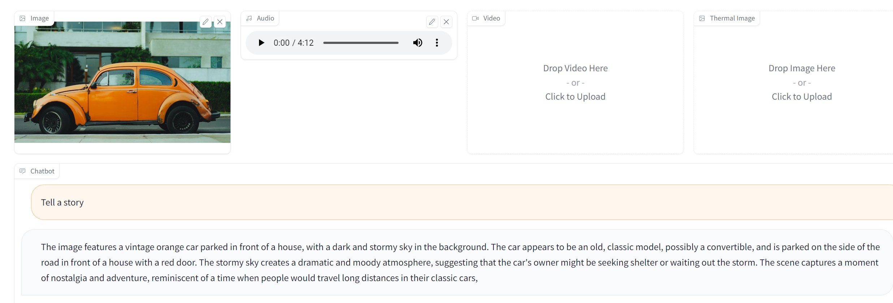
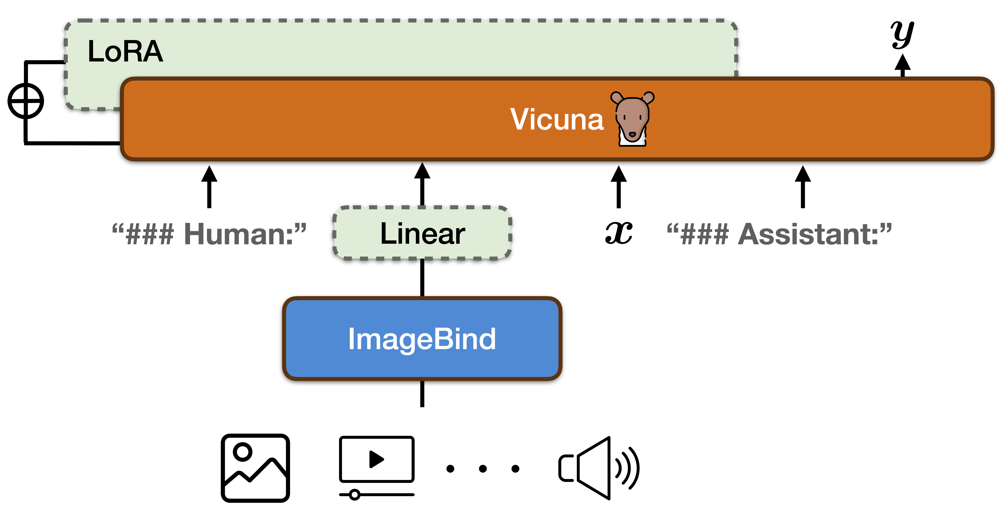

<p align="center" width="100%">

</p>

# PandaGPT: One Model To Instruction-Follow Them All


<p align="left">
   🌐 <a href="https://panda-gpt.github.io/" target="_blank">Project Page</a> • 🤗 <a href="https://huggingface.co/spaces/GMFTBY/PandaGPT" target="_blank">Online Demo</a> • 🤗 <a href="https://ailabnlp.tencent.com/research_demos/panda_gpt/" target="_blank">Online Demo-2 (Runs fast for users from mainland China)</a> • 📃 <a href="http://arxiv.org/abs/2305.16355" target="_blank">Paper</a> •  ⏬ <a href="https://github.com/yxuansu/PandaGPT/blob/main/README.md#31-data-preparation" target="_blank">Data</a> • 🤖 <a href="https://github.com/yxuansu/PandaGPT/blob/main/README.md#24-prepare-delta-weights-of-pandagpt" target="_blank">Model</a> • 📹 <a href="https://www.youtube.com/watch?v=96XgdQle7EY" target="_blank">Video</a>
</p>


**Team:** [Yixuan Su](https://yxuansu.github.io/)<sup>\*</sup>, [Tian Lan](https://github.com/gmftbyGMFTBY)<sup>\*</sup>, [Huayang Li](https://sites.google.com/view/huayangli)<sup>\*</sup>, Jialu Xu, Yan Wang, and [Deng Cai](https://jcyk.github.io/)<sup>\*</sup> (Major contributors<sup>\*</sup>)

****

## Online Demo Demonstration:

Below, we demonstrate some examples of our online [demo](https://huggingface.co/spaces/GMFTBY/PandaGPT). For more generated examples of PandaGPT, please refer to our [webpage](https://panda-gpt.github.io/) or our [paper](https://github.com/yxuansu/PandaGPT/blob/main/PandaGPT.pdf).

<p align="center" width="100%">

</p>

(1) In this example, PandaGPT takes an input image and reasons over the user's input.

<p align="center" width="100%">

</p>

(2) In this example, PandaGPT takes the joint input from two modalities, i.e. (1) an <b>image</b> 👀 of car and (2) an <b>audio</b>👂 of thunderstorm. 


****

<span id='all_catelogue'/>

## Catalogue:
* <a href='#introduction'>1. Introduction</a>
* <a href='#environment'>2. Running PandaGPT Demo</a>
    * <a href='#install_environment'>2.1. Environment Installation</a>
    * <a href='#download_imagebind_model'>2.2. Prepare ImageBind Checkpoint</a>
    * <a href='#download_vicuna_model'>2.3. Prepare Vicuna Checkpoint</a>
    * <a href='#download_pandagpt'>2.4. Prepare Delta Weights of PandaGPT</a>
    * <a href='#running_demo'>2.5. Deploying Demo</a>
* <a href='#train_pandagpt'>3. Train Your Own PandaGPT</a>
    * <a href='#data_preparation'>3.1. Data Preparation</a>
    * <a href='#training_configurations'>3.2. Training Configurations</a>
    * <a href='#model_training'>3.3. Training PandaGPT</a>
* <a href='#license'>Usage and License Notices</a>
* <a href='#citation'>Citation</a>
* <a href='#acknowledgments'>Acknowledgments</a>

****

<span id='introduction'/>

### 1. Introduction: <a href='#all_catelogue'>[Back to Top]</a>

<p align="center" width="100%">

</p>

**License** The icons in the image are taken from [this website](https://www.flaticon.com).


PandaGPT is the first foundation model capable of instruction-following data across six modalities, without the need of explicit supervision. It demonstrates a diverse set of multimodal capabilities such as complex understanding/reasoning, knowledge-grounded description, and multi-turn conversation.

PandaGPT is a general-purpose instruction-following model that can both <b>see 👀</b> and <b>hear👂</b>. Our pilot experiments show that PandaGPT can perform complex tasks such as detailed image description generation, writing stories inspired by videos, and answering questions about audios. More Interestingly, PandaGPT can take multimodal inputs simultaneously and compose their semantics naturally. For example, PandaGPT can connect how objects look in a photo and how they sound in an audio. 


****

<span id='environment'/>

### 2. Running PandaGPT Demo: <a href='#all_catelogue'>[Back to Top]</a>

<span id='install_environment'/>

#### 2.1. Environment Installation:
To install the required environment, please run
```
pip install -r requirements.txt
```

Then install the Pytorch package with the correct cuda version, for example
```
pip install torch==1.13.1+cu117 -f https://download.pytorch.org/whl/torch/
```

<span id='download_imagebind_model'/>

#### 2.2. Prepare ImageBind Checkpoint:
You can download the pre-trained ImageBind model using [this link](https://dl.fbaipublicfiles.com/imagebind/imagebind_huge.pth). After downloading, put the downloaded file (imagebind_huge.pth) in [[./pretrained_ckpt/imagebind_ckpt/]](./pretrained_ckpt/imagebind_ckpt/) directory. 

<span id='download_vicuna_model'/>

#### 2.3. Prepare Vicuna Checkpoint:
To prepare the pre-trained Vicuna model, please follow the instructions provided [[here]](./pretrained_ckpt#1-prepare-vicuna-checkpoint).


<span id='download_pandagpt'/>

#### 2.4. Prepare Delta Weights of PandaGPT:

|**Base Language Model**|**Maximum Sequence Length**|**Huggingface Delta Weights Address**|
|:-------------:|:-------------:|:-------------:|
|Vicuna-7B (version 0)|512|[openllmplayground/pandagpt_7b_max_len_512](https://huggingface.co/openllmplayground/pandagpt_7b_max_len_512)|
|Vicuna-7B (version 0)|1024|[openllmplayground/pandagpt_7b_max_len_1024](https://huggingface.co/openllmplayground/pandagpt_7b_max_len_1024)|
|Vicuna-13B (version 0)|256|[openllmplayground/pandagpt_13b_max_len_256](https://huggingface.co/openllmplayground/pandagpt_13b_max_len_256)|
|Vicuna-13B (version 0)|400|[openllmplayground/pandagpt_13b_max_len_400](https://huggingface.co/openllmplayground/pandagpt_13b_max_len_400)|

We release the delta weights of PandaGPT trained with different strategies in the table above. After downloading, put the downloaded 7B/13B delta weights file (pytorch_model.pt) in the [./pretrained_ckpt/pandagpt_ckpt/7b/](./pretrained_ckpt/pandagpt_ckpt/7b/) or [./pretrained_ckpt/pandagpt_ckpt/13b/](./pretrained_ckpt/pandagpt_ckpt/13b/) directory. In our [online demo](https://huggingface.co/spaces/GMFTBY/PandaGPT), we use the `openllmplayground/pandagpt_7b_max_len_1024` as our default model due to the limitation of computation resource. Better results are expected if switching to `openllmplayground/pandagpt_13b_max_len_400`.

<span id='running_demo'/>

#### 2.5. Deploying Demo:
Upon completion of previous steps, you can run the demo locally as
```bash
cd ./code/
CUDA_VISIBLE_DEVICES=0 python web_demo.py
```

If you running into `sample_rate` problem, please git install `pytorchvideo` from the source as
```yaml
git clone https://github.com/facebookresearch/pytorchvideo
cd pytorchvideo
pip install --editable ./
```

****

<span id='train_pandagpt'/>

### 3. Train Your Own PandaGPT: <a href='#all_catelogue'>[Back to Top]</a>

**Prerequisites:** Before training the model, making sure the environment is properly installed and the checkpoints of ImageBind and Vicuna are downloaded. You can refer to [here](https://github.com/yxuansu/PandaGPT#2-running-pandagpt-demo-back-to-top) for more information.  

<span id='data_preparation'/>

#### 3.1. Data Preparation:

**Declaimer:** To ensure the reproducibility of our results, we have released our training dataset. The dataset must be used for research purpose only. The use of the dataset must comply with the licenses from original sources, i.e. LLaVA and MiniGPT-4. These datasets may be taken down when requested by the original authors.

|**Training Task**|**Dataset Address**|
|:-------------:|:-------------:|
|Visual Instruction-Following|[openllmplayground/pandagpt_visual_instruction_dataset](https://huggingface.co/datasets/openllmplayground/pandagpt_visual_instruction_dataset)|

After downloading, put the downloaded file and unzip them under the [./data/](./data/) directory.

> **** The directory should look like:

    .
    └── ./data/ 
         ├── pandagpt4_visual_instruction_data.json
         └── /images/
             ├── 000000426538.jpg
             ├── 000000306060.jpg
             └── ...
              

<span id='training_configurations'/>

#### 3.2 Training Configurations:

The table below show the training hyperparameters used in our experiments. The hyperparameters are selected based on the constrain of our computational resources, i.e. 8 x A100 (40G) GPUs.

|**Base Language Model**|**Training Task**|**Epoch Number**|**Batch Size**|**Learning Rate**|**Maximum Length**|
|:-------------:|:-------------:|:-------------:|:-------------:|:-------------:|:-------------:|
|7B|Visual Instruction|2|64|5e-4|1024|
|13B|Visual Instruction|2|64|5e-4|400|


<span id='model_training'/>


#### 3.3. Training PandaGPT:
 
To train PandaGPT, please run the following commands:
```yaml
cd ./code/scripts/
chmod +x train.sh
cd ..
./scripts/train.sh
```

The key arguments of the training script are as follows:
* `--data_path`: The data path for the json file `pandagpt4_visual_instruction_data.json`.
* `--image_root_path`: The root path for the downloaded images.
* `--imagebind_ckpt_path`: The path where saves the ImageBind checkpoint `imagebind_huge.pth`.
* `--vicuna_ckpt_path`: The directory that saves the pre-trained Vicuna checkpoints.
* `--max_tgt_len`: The maximum sequence length of training instances.
* `--save_path`: The directory which saves the trained delta weights. This directory will be automatically created.

Note that the epoch number can be set in the `epochs` argument at [./code/config/openllama_peft.yaml](./code/config/openllama_peft.yaml) file. The `train_micro_batch_size_per_gpu` and `gradient_accumulation_steps` arguments in [./code/dsconfig/openllama_peft_stage_1.json](./code/dsconfig/openllama_peft_stage_1.json) should be set as `2` and `4` for 7B model, and set as `1` and `8` for 13B model.

****

<span id='license'/>

### Usage and License Notices:

PandaGPT is intended and licensed for research use only. The dataset is CC BY NC 4.0 (allowing only non-commercial use) and models trained using the dataset should not be used outside of research purposes. The delta weights are also CC BY NC 4.0 (allowing only non-commercial use).


****

<span id='citation'/>

### Citation:

If you found PandaGPT useful in your research or applications, please kindly cite using the following BibTeX:
```
@article{su2023pandagpt,
  title={PandaGPT: One Model To Instruction-Follow Them All},
  author={Su, Yixuan and Lan, Tian and Li, Huayang and Xu, Jialu and Wang, Yan and Cai, Deng},
  journal={arXiv preprint arXiv:2305.16355},
  year={2023}
}
```


****

<span id='acknowledgments'/>

### Acknowledgments:


This repo benefits from [OpenAlpaca](https://github.com/yxuansu/OpenAlpaca), [ImageBind](https://github.com/facebookresearch/ImageBind), [LLaVA](https://github.com/haotian-liu/LLaVA), and [MiniGPT-4](https://github.com/Vision-CAIR/MiniGPT-4). Thanks for their wonderful works!


 


